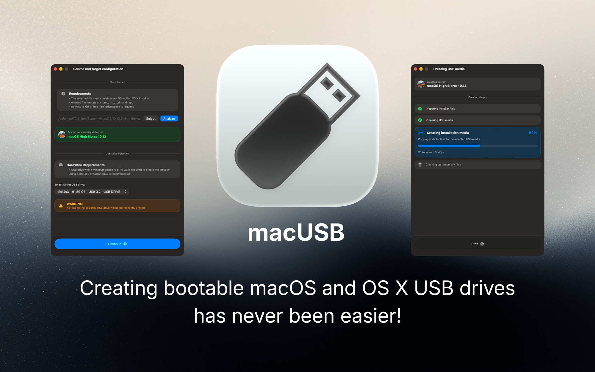
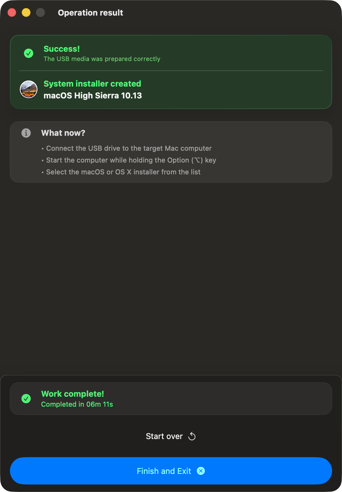

#  macUSB

### Creating bootable macOS and OS X USB drives has never been easier!

     

**macUSB** is a guided macOS app for creating bootable USB installers from `.dmg`, `.iso`, `.cdr`, and `.app` sources.

**Primary download:** [Download latest release](https://github.com/Kruszoneq/macUSB/releases/latest)  
**Project website:** [kruszoneq.github.io/macUSB](https://kruszoneq.github.io/macUSB/)

---

## ☕ Support the Project

**macUSB is and will always remain completely free.** Every update and feature is available to everyone.  
If the project helps you, you can support ongoing development:

---

## 🖼️ Preview

  

---

## 🔍 Why macUSB Exists

As Apple Silicon Macs became the default host machines, preparing bootable USB installers for **macOS Catalina and older** became a common pain point.

Common issues reported across forums and guides include:
- codesign and certificate validation failures on legacy installer paths,
- version-dependent compatibility constraints and tooling differences on newer hosts,
- manual terminal workflows that are easy to misconfigure and hard to verify.

**macUSB was built from practical research and tested fixes** gathered during repeated troubleshooting of those legacy installer paths.  
The app wraps that work into a guided, safer workflow so users can prepare media without manually stitching together fragile commands.

---

## ✨ What’s New in v2.0

- Native privileged helper via **SMAppService** for a more stable, terminal-free creation workflow.
- New creation progress UX: per-stage status + real-time write speed.
- Better completion feedback: finish sound and optional system notifications.
- Safer media handling: USB 2.0 throughput warning and automatic partition/filesystem preparation.
- Better supportability and localization: diagnostic log export plus new UI languages (IT, UK, VI, TR).

---

## ✅ Key Features

- **One guided flow:** from source analysis to final bootable media.
- **Broad source support:** `.dmg`, `.iso`, `.cdr`, and `.app`.
- **Legacy compatibility focus:** supports modern macOS plus older OS X / Mac OS X generations.
- **Automatic media prep:** partition and format checks with conversion when required.
- **PowerPC-ready paths:** dedicated support for Tiger/Leopard-era scenarios.
- **Notarized build:** Apple-notarized app for safer first launch.

---

## ⚡ Quick Start

1. Download the app from [latest releases](https://github.com/Kruszoneq/macUSB/releases/latest).
2. Open macUSB and select an installer source file (`.dmg`, `.iso`, `.cdr`, or `.app`).
3. Select the target USB drive and review operation details.
4. Start creation and monitor stage-by-stage progress.
5. Use the final result screen for next steps.

> Warning: All data on the selected USB drive will be erased.

---

## 🧭 App Workflow

  Click any screenshot to open full size.

<table align="center">
  <tr>
    <td align="center" valign="top">
      <strong>1. Welcome</strong> 
       
      Start the workflow.
    </td>
    <td align="center" valign="top">
      <strong>2. Source &amp; Target</strong> 
       
      Select installer and USB drive.
    </td>
    <td align="center" valign="top">
      <strong>3. Operation Details</strong> 
       
      Review process before start.
    </td>
  </tr>
  <tr>
    <td align="center" valign="top">
      <strong>4. Creating USB Media</strong> 
       
      Track stage-by-stage progress.
    </td>
    <td align="center" valign="top">
      <strong>5. Operation Result</strong> 
       
      Finish with next-step guidance.
    </td>
    <td></td>
  </tr>
</table>

---

## ⚙️ Requirements

### Host Computer
- **Processor:** Apple Silicon or Intel.
- **System:** **macOS 14.6 Sonoma** or newer.
- **Free disk space:** at least **15 GB** available for installer preparation.

### USB Media
- **Capacity:** at least **16 GB**; use **32 GB minimum** for **macOS 15 Sequoia** and **macOS 26 Tahoe** installers.
- **Performance:** USB 3.0+ is recommended.
- **External HDD/SSD support:** installer creation on external hard drives is disabled by default on every app launch to improve safety and reduce the risk of accidental target selection. You can enable it in **Options** -> **Enable external drives support**.

### Installer Source Files
Accepted source types:
- `.dmg`
- `.cdr`
- `.iso`
- `.app`

Recommended installer sources:
- **OS X 10.7-10.8** and **10.10 through macOS 26:** [the **Mist app**](https://github.com/ninxsoft/Mist)
- **OS X 10.9 Mavericks:** recommended and verified source is [Mavericks Forever](https://mavericksforever.com/). Images from other sources may not work correctly.
- **Mac OS X 10.4-10.6 (Intel):** Internet Archive
- **Mac OS X 10.4-10.5 (PowerPC):** Macintosh Garden

---

## 💿 Supported Versions

Systems recognized and supported for USB creation:

| System | Version | Supported |
| :--- | :--- | :---: |
| **macOS Tahoe** | 26 | ✅ |
| **macOS Sequoia** | 15 | ✅ |
| **macOS Sonoma** | 14 | ✅ |
| **macOS Ventura** | 13 | ✅ |
| **macOS Monterey** | 12 | ✅ |
| **macOS Big Sur** | 11 | ✅ |
| **macOS Catalina** | 10.15 | ✅ |
| **macOS Mojave** | 10.14 | ✅ |
| **macOS High Sierra** | 10.13 | ✅ |
| **macOS Sierra**[^1] | 10.12 | ✅ |
| **OS X El Capitan** | 10.11 | ✅ |
| **OS X Yosemite** | 10.10 | ✅ |
| **OS X Mavericks**[^2] | 10.9 | ✅ |
| **OS X Mountain Lion** | 10.8 | ✅ |
| **OS X Lion** | 10.7 | ✅ |
| **Mac OS X Snow Leopard** | 10.6 | ✅ |
| **Mac OS X Leopard** | 10.5 | ✅ |
| **Mac OS X Tiger**[^3] | 10.4 | ✅ |

[^1]: Only **10.12.6** is supported.
[^2]: Fully verified with the image from [Mavericks Forever](https://mavericksforever.com/). Other sources may fail.
[^3]: **Single DVD** is auto-detected. **Multi-DVD** guide: [Tiger Multi-DVD Guide](https://kruszoneq.github.io/macUSB/pages/guides/multidvd_tiger.html).

---

## 🧩 Legacy & PowerPC Notes

During research and real boot-testing for PowerPC USB workflows, a dedicated Open Firmware guide was created and published on the project website.

The guide is based on practical tests of USB installers created with macUSB, including:
- **Mac OS X Tiger** and **Mac OS X Leopard** boot scenarios,
- **Single DVD** editions, and for Tiger also the **Multi-DVD** path,
- Open Firmware boot command usage verified on an **iMac G5** test machine.

If you are reviving a PowerPC Mac, this is the recommended starting point:
- [Step-by-step: Booting from USB on PowerPC Macs](https://kruszoneq.github.io/macUSB/pages/guides/ppc_boot_instructions.html)

---

## 🌍 Available Languages

The interface follows system language automatically:

- 🇵🇱 Polish (PL)
- 🇺🇸 English (EN)
- 🇩🇪 German (DE)
- 🇯🇵 Japanese (JA)
- 🇫🇷 French (FR)
- 🇪🇸 Spanish (ES)
- 🇧🇷 Portuguese (PT-BR)
- 🇨🇳 Simplified Chinese (ZH-Hans)
- 🇷🇺 Russian (RU)
- 🇮🇹 Italian (IT)
- 🇺🇦 Ukrainian (UK)
- 🇻🇳 Vietnamese (VI)
- 🇹🇷 Turkish (TR)

---

## 🛠️ Diagnostics & Support

- Report bugs and feature requests via [GitHub Issues](https://github.com/Kruszoneq/macUSB/issues).
- Use issue templates to speed up triage and reproducibility.
- Export logs from **Help** -> **Export diagnostic logs...** when reporting technical problems.

Helpful details in bug reports:
- Host macOS version
- Target installer version
- Source format (`.dmg`, `.iso`, `.cdr`, `.app`)
- Installer source link
- Screenshot of error/result state

---

## ⚖️ License

Licensed under the **MIT License**.

Copyright © 2025-2026 Krystian Pierz
