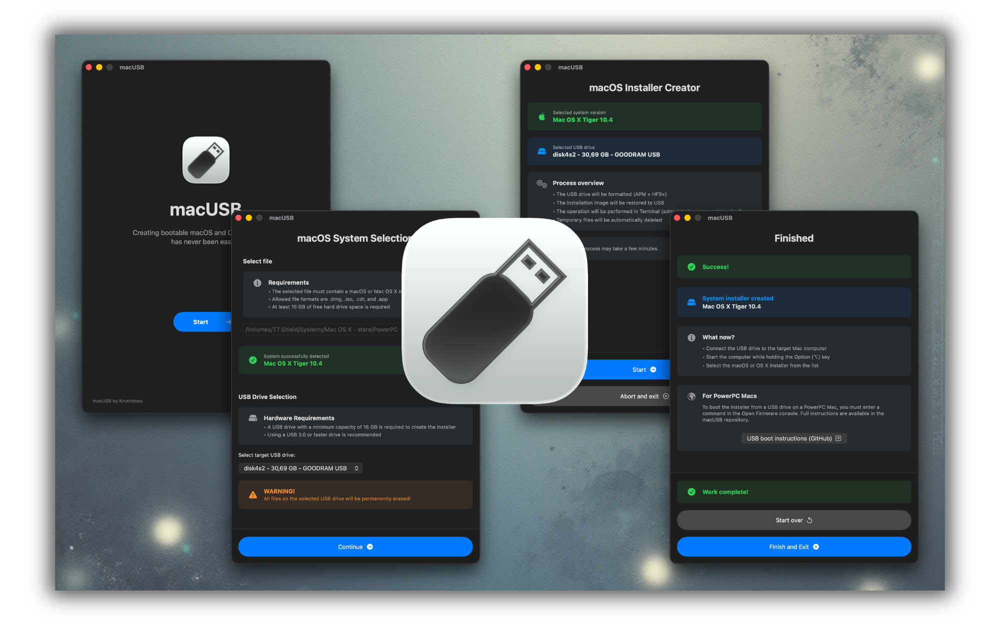

#  macUSB

### Creating bootable macOS and OS X USB drives has never been easier!

   

**macUSB** is a one-click tool that transforms your modern Mac (Apple Silicon) into a service machine capable of reviving older Apple computers.

---
## 🖼️ Preview

  

## 🚀 About the Project

With Apple's transition to its own silicon (M1, M2, M3...), preparing installation media for older Intel- and PowerPC-based computers has become a challenge. Many people encounter Terminal errors, issues with expired certificates in old installers, or simply a lack of compatibility with system tools.

**macUSB solves this problem.**

The application automates the entire process of creating a bootable USB drive. You don't need to search for commands online, worry about disk formatting, or manually fix validation errors in old installation files.

### What do you gain?
* **Legacy Support:** The ability to create installers for systems over a decade old (e.g., OS X Lion) directly on the latest Mac on Apple Silicon.
* **Time Saving:** The app detects the system version in the **`.dmg`**, **`.iso`**, **`.cdr`** or **`.app`** file, formats the drive, and copies files automatically.
* **Auto Fixes:** For certain systems (e.g., High Sierra/Mojave), the app automatically applies necessary fixes so the installer works despite expired Apple certificates.
* **PowerPC Revival:** The app formats USB drives to the Apple Partition Map (APM) scheme required by PowerPC Macs and transfers the installer directly from **`.iso`**, **`.cdr`** or **`.dmg`** files. This allows for installation without the need for physical CDs/DVDs or FireWire drives.
  
  > 📖 **Guide:** [Step-by-step: Booting from USB on PowerPC Macs using Open Firmware](.github/PPC_BOOT_INSTRUCTIONS.md)

> **Fun Fact:** The application was created using the "Vibe Coding" method in collaboration with the Gemini 3 Pro and GPT-5 AI models. The project proves that programming barriers (even cross-architectural ones) can be overcome with determination and AI support.

---

## ⚠️ Installation and First Run

The application is an open-source project and does not possess a paid Apple Developer signature, so Gatekeeper will block it by default.

**How to run the app for the first time:**

1. Try to open the app - you will see an "Unknown Developer" message.
2. Go to **System Settings** -> **Privacy & Security**.
3. Scroll down to the **Security** section and click the **"Open Anyway"** button next to macUSB.
4. When writing the system to the flash drive, a system prompt asking for **access to removable volumes** will appear. You must **Allow** this so the application can format and write the system to the USB.

---

## ⚙️ Requirements

### Host Computer (where you run the app):
* **Processor:** Both Apple Silicon and Intel are supported.
* **System:** **macOS Sonoma 14.6** or newer.
* **Storage:** Minimum of **15 GB** of free disk space is required **to create the installers**.

### USB Drives (for installer creation):
* **Capacity:** Minimum of **16 GB** is required.
* **Recommendation:** USB 3.0 or newer is highly recommended for faster installation times.

### Installation Files:
The program supports **`.dmg`**, **`.cdr`** and **`.iso`** disk images, as well as raw **`.app`** installer files.

> **💡 Pro Tip:** The best way to obtain valid files is the free application **[MIST by ninxsoft](https://github.com/ninxsoft/Mist)**. Simply select the system version you are interested in. This guarantees the correct file structure/source.

---

## 💿 Supported Versions

The table lists systems supported by the application that are successfully recognized and written to a USB drive.
(✅ - Supported, ❌ - Not supported)

| System | Version | Supported |
| :--- | :--- | :---: |
| **macOS Tahoe** | 26 | ✅ |
| **macOS Sequoia** | 15 | ✅ |
| **macOS Sonoma** | 14 | ✅ |
| **macOS Ventura** | 13 | ✅ |
| **macOS Monterey** | 12 | ✅ |
| **macOS Big Sur** | 11 | ✅ |
| **macOS Catalina** | 10.15 | ✅ |
| **macOS Mojave** | 10.14 | ✅ |
| **macOS High Sierra** | 10.13 | ✅ |
| **macOS Sierra**[^1] | 10.12 | ✅ |
| **OS X El Capitan** | 10.11 | ✅ |
| **OS X Yosemite** | 10.10 | ✅ |
| **OS X Mavericks** | 10.9 | ❌ |
| **OS X Mountain Lion** | 10.8 | ✅ |
| **OS X Lion** | 10.7 | ✅ |
| **Mac OS X Snow Leopard** | 10.6 | ✅ |
| **Mac OS X Leopard** | 10.5 | ✅ |
| **Mac OS X Tiger**[^2] | 10.4 | ✅ |

[^1]: Only version **10.12.6** is supported.
[^2]: Automatic detection supports only the **Single DVD** edition. Multi-disc editions might be unrecognized or misidentified (e.g., as "Read Before You Install"). In such cases, please use **File** → **“Skip file analysis”** → **“Mac OS X Tiger 10.4 (Multi DVD)”** or press the keyboard shortcut **Command (⌘)** + **Option (⌥)** + **T**.  💡 **Installation Tip:** When the installer requests the second disc (Disc 2), simply unplug the USB drive containing Disc 1 and insert the USB drive containing Disc 2. The **installer on the target Mac** will automatically detect the new volume and continue the installation.

---
 
## 🌍 Available Languages

The application interface automatically adapts to the system language:

* 🇵🇱 Polish (PL)
* 🇺🇸 English (EN)
* 🇩🇪 German (DE)
* 🇯🇵 Japanese (JA)
* 🇫🇷 French (FR)
* 🇪🇸 Spanish (ES)
* 🇧🇷 Portuguese (PT-BR)
* 🇨🇳 Simplified Chinese (ZH-Hans)
* 🇷🇺 Russian (RU)

---

## ⚖️ License

This project is licensed under the **MIT License**.

This means you are free to use, copy, modify, and distribute this code, provided you keep the author information. The software is provided "as is", without warranty of any kind.

Copyright © 2025-2026 Krystian Pierz

---

**Note:** The application interface and this README file were translated using Gemini 3 Pro. Please excuse any potential translation errors.

