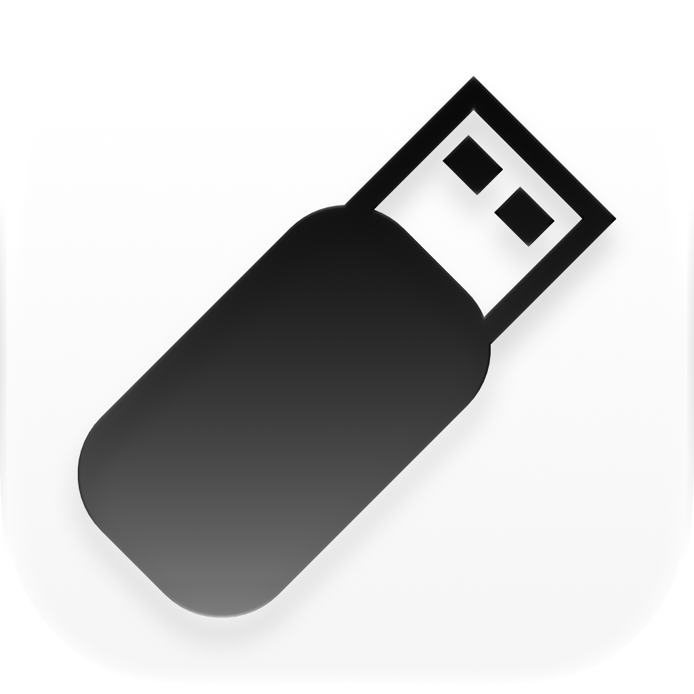
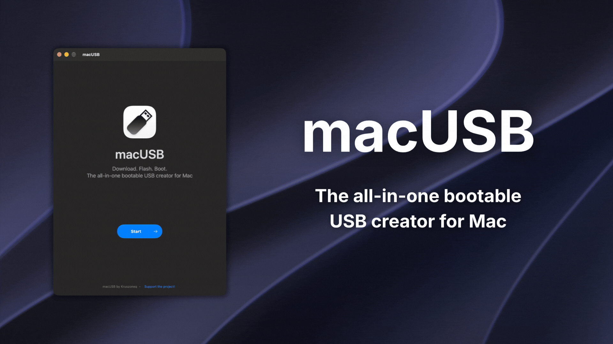
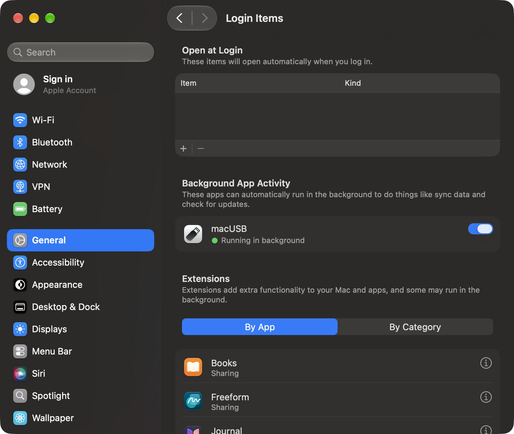
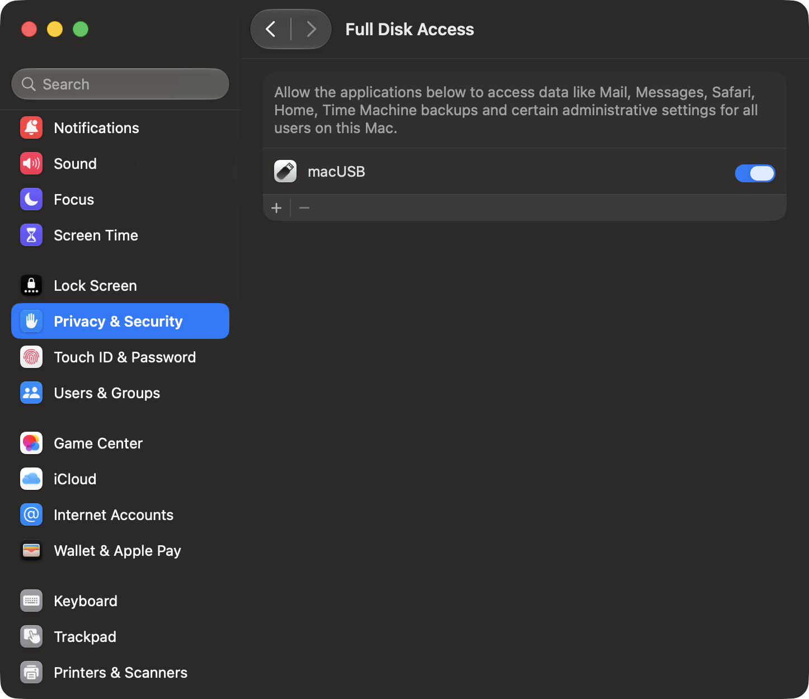
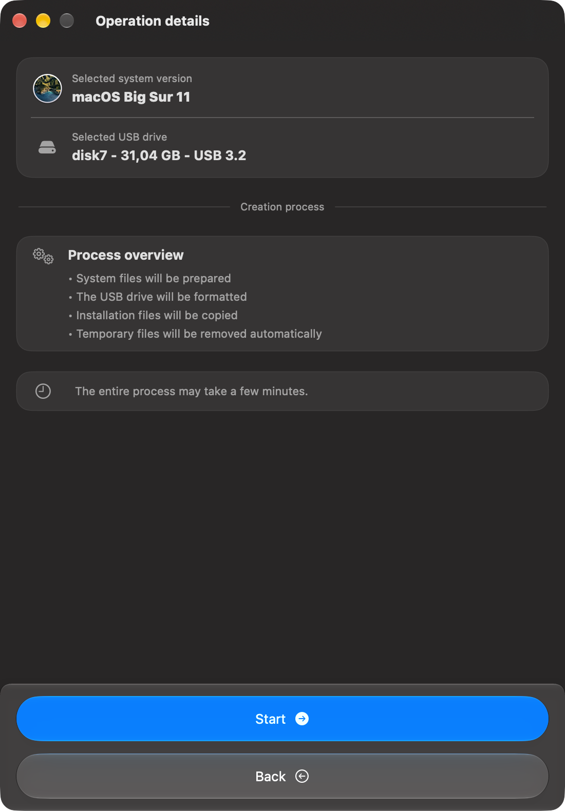
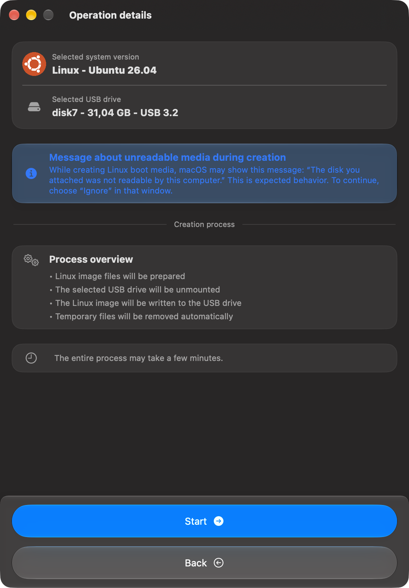
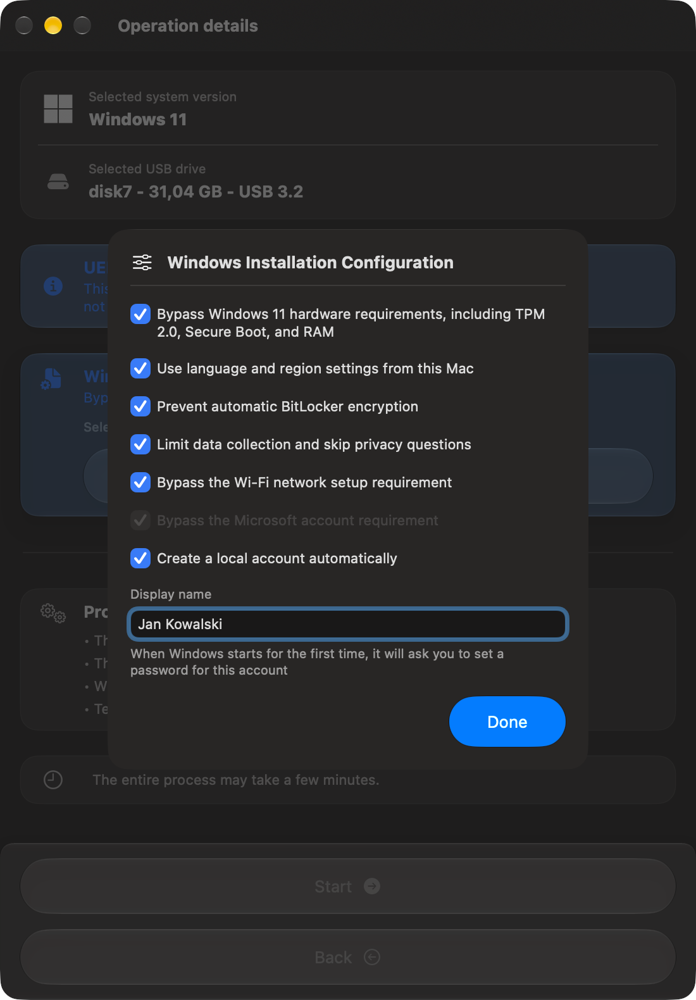
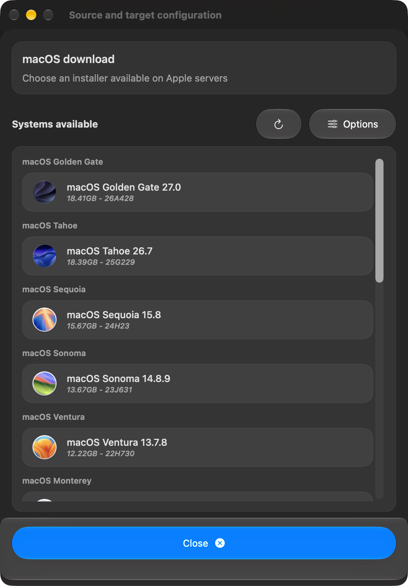
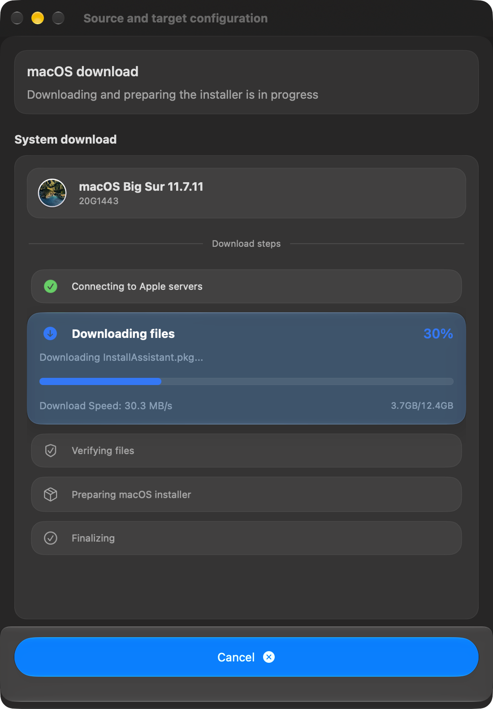
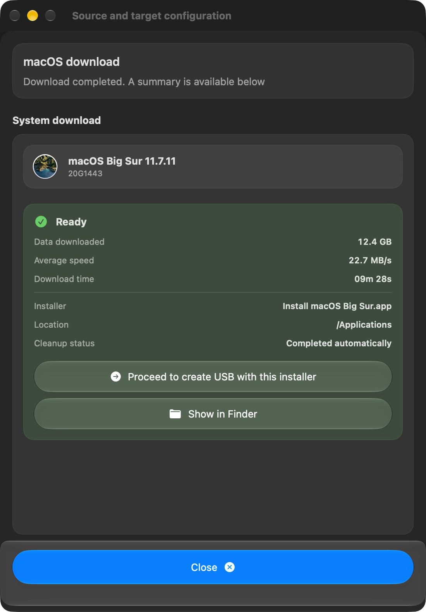

# &nbsp;&nbsp;macUSB

*The all-in-one bootable USB creator for Mac*

    [](https://macusb.app/)

**macUSB** is a guided macOS app for creating bootable USB media on Apple Silicon and Intel Macs using local files or the built-in macOS downloader.

---

<p align="center">
  
</p>

---

## ☕ Support the Project

**macUSB is and will always remain completely free.** Every update and feature is available to everyone.  
If the project helps you, you can support ongoing development:

<a href="https://www.buymeacoffee.com/kruszoneq" target="_blank"></a>

---

## 📥 How to Download macUSB

Choose one installation method:

1. **GitHub Releases:** [Download the latest release](https://github.com/Kruszoneq/macUSB/releases/latest)
2. **Homebrew:**

   ```bash
   brew install --cask macusb
   ```

---

## 🔍 Why macUSB Exists

Creating bootable USB installers for **macOS Catalina and older** on modern Macs, especially Apple Silicon models, can be challenging because legacy installer workflows often conflict with newer system requirements. macUSB was created to make this process guided and reliable through solutions developed and verified during practical troubleshooting.

Thanks to user feedback, macUSB has grown beyond legacy macOS installer creation to include an integrated macOS downloader and support for creating bootable Linux and Windows media, evolving into an all-in-one tool for bootable USB workflows on Mac.

---

## ✅ Key Features

- **Built-in downloader:** discover and download macOS installers, including available Public Beta releases, from Apple servers.
- **Local source support:** create bootable USB media from local installers and disk images.
- **Checksum calculation:** calculate SHA-256 checksums for supported `.dmg`, `.cdr`, and `.iso` sources, as well as manually selected raw `.img` images.
- **Apple silicon legacy support:** automatic compatibility handling for older macOS installers during USB creation.
- **Automatic media preparation:** validate target capacity and prepare the selected drive for the chosen workflow.
- **Linux and Windows support:** create bootable USB media from supported Linux and Windows `.iso` images, with optional Windows setup automation.

---

## ⚡ Quick Start

> [!WARNING]
> Creating bootable media erases all data on the selected USB drive.

1. Install macUSB using one of the methods listed in **How to Download macUSB**.
2. Open macUSB and either:
   - choose a local source, or
   - use the built-in Downloader to fetch a macOS installer from Apple.
3. Select the target USB drive and review the operation details.
4. Start the process and monitor bootable media creation stage by stage.
5. Review the final result and safely eject the USB drive directly from the final screen.

> [!IMPORTANT]
> For reliable media creation, enable **Allow in the Background** and **Full Disk Access** for macUSB in System Settings. Without them, creation workflows may fail.

<table align="center">
  <tr>
    <td align="center" valign="top">
      <strong>Allow in the Background</strong><br>
      <a href="docs/readme-assets/permissions/allow-in-the-background.png">
        
      </a><br>
      <sub>General → Login Items &amp; Extensions</sub>
    </td>
    <td align="center" valign="top">
      <strong>Full Disk Access</strong><br>
      <a href="docs/readme-assets/permissions/full-disk-access.png">
        
      </a><br>
      <sub>Privacy &amp; Security → Full Disk Access</sub>
    </td>
  </tr>
</table>

---

## 🧭 Workflow Details

<p align="center">
  Click a screenshot to view it at full size.
</p>

<table align="center">
  <tr>
    <td align="center" valign="top">
      <strong>macOS Installer</strong><br>
      <a href="docs/readme-assets/app-screens/ConfirmationMacOSBigSur.png">
        
      </a><br>
      <sub>Review the selected macOS version, target USB drive, and creation steps before starting.</sub>
    </td>
    <td align="center" valign="top">
      <strong>Linux Image</strong><br>
      <a href="docs/readme-assets/app-screens/ConfirmationUbuntu.png">
        
      </a><br>
      <sub>The Linux workflow includes guidance for handling the expected unreadable-disk prompt shown by macOS during creation.</sub>
    </td>
    <td align="center" valign="top">
      <strong>Windows Installer</strong><br>
      <a href="docs/readme-assets/app-screens/ConfigurationWindowsEleven.png">
        
      </a><br>
      <sub>The Windows workflow offers optional configuration for selected Windows restrictions and first-run setup choices.</sub>
    </td>
  </tr>
</table>

---

## 🌐 Downloader Workflow

<p align="center">
  Click a screenshot to view it at full size.
</p>

<table align="center">
  <tr>
    <td align="center" valign="top">
      <strong>1. Installer List</strong><br>
      <a href="docs/readme-assets/app-screens/DownloaderCatalogOverview.png">
        
      </a><br>
      <sub>Browse macOS installers available from Apple servers.</sub>
    </td>
    <td align="center" valign="top">
      <strong>2. Download Progress</strong><br>
      <a href="docs/readme-assets/app-screens/DownloaderProgress.png">
        
      </a><br>
      <sub>Track download and preparation progress in real time.</sub>
    </td>
    <td align="center" valign="top">
      <strong>3. Download Summary</strong><br>
      <a href="docs/readme-assets/app-screens/DownloaderCompleted.png">
        
      </a><br>
      <sub>Review the final status, then continue to USB creation with the downloaded installer.</sub>
    </td>
  </tr>
</table>

Downloader options can save the completed installer as a read-only DMG in a selected destination folder.

---

## ⚙️ Requirements

### Host Computer

- **Architecture:** Apple silicon or Intel.
- **System:** **macOS Sonoma 14.6** or later.
- **Free disk space:**
  - **Downloader stage:** required free space depends on the selected installer and optional DMG output; macUSB checks the exact requirement before downloading.
  - **USB creation stage:** additional temporary disk space may be required depending on the selected source and workflow.

### USB Media

- **For macOS installers:** at least **16 GB**, or at least **32 GB** for **macOS Sequoia 15 and later**.
- **For Windows/Linux images:** **1 GB** or more, depending on the size of the selected `.iso` image.
- **Performance:** USB 3.0+ is recommended.

> [!NOTE]
> External HDD/SSD support is disabled by default each time the app launches to improve safety and reduce the risk of accidental target selection. It can be enabled from **Options → Enable external hard drive support**.

### Source Inputs

Accepted local source formats:

- **For macOS:** `.dmg`, `.cdr`, `.iso`, and `.app`
- **For Windows/Linux:** `.iso`

---

## 💿 macOS Support

macUSB supports creating bootable USB installers across the **macOS**, **OS X**, and **Mac OS X** system families, from **macOS Golden Gate 27** through **Mac OS X Tiger 10.4**. Some systems have additional requirements or limitations.[^1]

On Macs running **macOS Golden Gate**, **Rosetta** is not installed by default. It is required for installers from **OS X Yosemite through macOS Catalina** that include an Intel-only `createinstallmedia` tool. macUSB checks for Rosetta automatically and, when needed, offers to install it with one click.

> [!NOTE]
> For **OS X Yosemite and later**, if the target USB drive is already partitioned as **GPT** and contains an **HFS+** volume, hold **Option (⌥)** while selecting the target to choose an individual volume without reformatting the entire drive. The selected volume itself will still be erased during installer creation.

[^1]: **System-specific requirements and limitations:**

    - **macOS Golden Gate 27:** Creating its bootable USB installer is supported only on Macs with **Apple silicon**. The Mac used to create the installer does not need to be running macOS Golden Gate.
    - **macOS Sierra 10.12:** Only **10.12.6** is supported.
    - **OS X Mavericks 10.9:** Fully verified with the image from [Mavericks Forever](https://mavericksforever.com/). Other sources may fail.
    - **Mac OS X Tiger 10.4:** **Single-DVD** images are auto-detected. For **Multi-DVD** images, only the first disc is recognized correctly. Other discs may appear as unrecognized or be identified incorrectly. To use them, force detection manually from **Options** → **Skip file analysis** → **Mac OS X Tiger 10.4 (Multi DVD)**.

---

## 🪟 Windows Support

macUSB recognizes original Microsoft Windows `.iso` images from **Windows XP through Windows 11** and **Windows Server 2003 through Windows Server 2025**, and automatically detects their Windows family, optional Service Pack, and architecture.

Bootable USB creation is supported for **Windows Vista through Windows 11** and **Windows Server 2008 R2 through Windows Server 2025**. Windows XP and Windows Server 2003 are recognized but are not supported for media creation.

Available boot modes depend on the Windows version:

- **Legacy BIOS only:** Windows Vista, Windows 7, and Windows Server 2008 R2.
- **Legacy BIOS or UEFI:** Windows 8, Windows 8.1, Windows 10, and Windows Server 2012 through 2022.
- **UEFI only:** Windows 11 and Windows Server 2025.

For legacy BIOS support, macUSB installs the [macUSBoot](https://github.com/Kruszoneq/macUSBoot) bootloader on the prepared media.

For 64-bit Windows 10 and Windows 11 images, macUSB can optionally prepare an `Autounattend.xml` file. It can automate selected first-run options, including local-account creation, language and region transfer, skipping selected network and privacy steps, bypassing the Microsoft account requirement, and preventing automatic BitLocker device encryption. For Windows 11, it can also bypass supported hardware checks.

Regardless of the selected boot mode, macUSB formats the target as **MBR** with **FAT32**. Because FAT32 has a **4 GB limit per file**, some modern Windows images may require extra preparation. If `install.wim` exceeds that limit, macUSB automatically splits it into smaller `.swm` parts using `wimlib`.

> [!IMPORTANT]
> [`wimlib`](https://wimlib.net/) is required only when the selected Windows image contains an `install.wim` file that must be split. It is not bundled with macUSB and must be installed separately by the user. The simplest way to install it is with Homebrew:
>
> ```bash
> brew install wimlib
> ```
>
> macUSB automatically checks whether `wimlib-imagex` is available when this step is required.

---

## 🐧 Linux Support

macUSB also supports creating bootable USB media from Linux `.iso` images.

When a Linux image is recognized, macUSB attempts to detect its distribution, version, and architecture automatically. Images with Linux signals but without a recognized distribution can still use the Linux creation workflow. The detected name explicitly identifies ARM builds, for example `Linux - Ubuntu 26.04 (ARM)`.

> [!NOTE]
> Linux support has been tested with 19 distributions.[^2]

[^2]: **Validated distributions:** *Ubuntu*, *Kali Linux*, *NixOS*, *Garuda Linux*, *openSUSE Leap*, *Gentoo*, *Rocky Linux*, *Linux Mint*, *Fedora Workstation*, *Manjaro*, *Zorin OS*, *CachyOS*, *AlmaLinux*, *Debian*, *Arch Linux*, *MX Linux*, *Pop!_OS*, *EndeavourOS*, and *elementary OS*. Testing covered the latest versions available as of April 30, 2026. Boot behavior was verified on a 2017 MacBook Air, a Dell OptiPlex 5040 with UEFI, and an ASUS F52Q with legacy BIOS.

---

## 💾 Raw Image Writing

macUSB can write `.iso` and `.img` files directly to external USB drives using **Tools → Write a Raw Image to a Drive…**.

This method can also be used when a Linux image is not recognized during analysis.

After writing a Linux or raw image, macUSB verifies the written data against the source using SHA-256.

> [!NOTE]
> The resulting media is not guaranteed to be bootable. Bootability depends on the structure and compatibility of the source image.

---

## 🧩 PowerPC Notes

For instructions on booting a USB installer created with macUSB on a PowerPC Mac, see the [Open Firmware USB boot guide](https://macusb.app/pages/guides/ppc_boot_instructions.html).

> [!NOTE]
> USB boot compatibility depends on the Mac model and its Open Firmware version. Not every PowerPC Mac can boot from USB.

---

## 🌍 Available Languages

By default, the interface follows the system language automatically. A supported language can also be selected manually from **Options → Language**:

- 🇵🇱 Polish (pl)
- 🇺🇸 English (en)
- 🇩🇪 German (de)
- 🇯🇵 Japanese (ja)
- 🇫🇷 French (fr)
- 🇪🇸 Spanish (es)
- 🇧🇷 Portuguese (pt-BR)
- 🇨🇳 Simplified Chinese (zh-Hans)
- 🇷🇺 Russian (ru)
- 🇮🇹 Italian (it)
- 🇺🇦 Ukrainian (uk)
- 🇻🇳 Vietnamese (vi)
- 🇹🇷 Turkish (tr)

---

## 🛠️ Troubleshooting

If you encounter a problem or have a question, please [open an issue](https://github.com/Kruszoneq/macUSB/issues).

---

## ⚖️ License

Licensed under the **MIT License**.

Copyright © 2025-2026 Krystian Pierz
